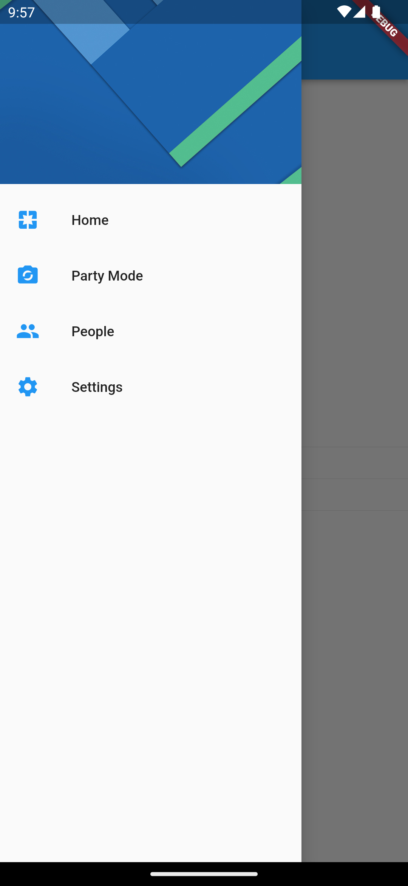
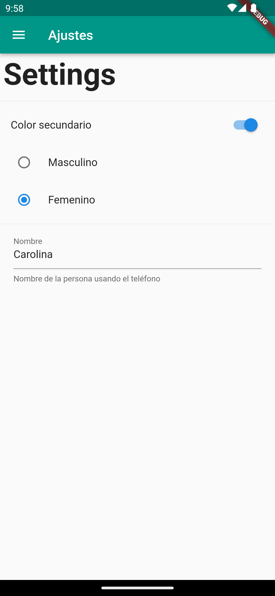
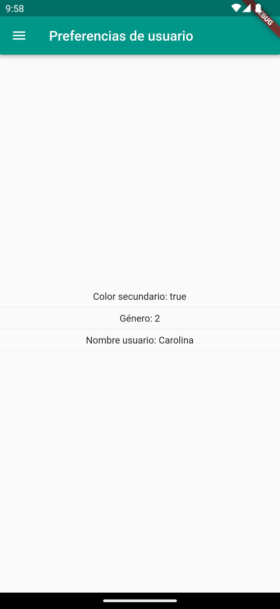

# Shared preferences Flutter

This app demonstrates the use of Flutter to save user preferences in local storage or cache.
It is a simple design because it is demonstrative, but it has things like, drawer menu, settings page, among others.

  
  
  
  

